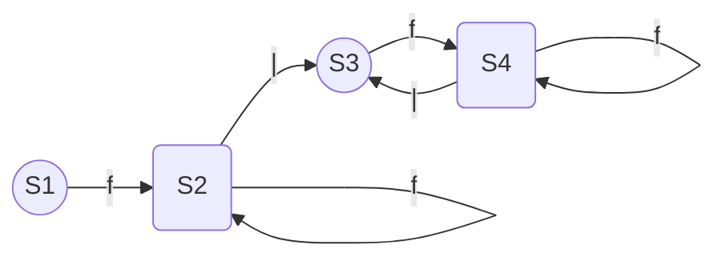

# Original EBNF

```
expr -> id
  | id
  | term
  | '(' expr ')'
  | expr '?'
  | expr '*'
  | expr '|' expr
  | expr expr

rule -> id ':' expr ';'

grammar -> rule*
```

# Equvalent Conversion With Out Left-Recursion

```
factor -> id '?' | id '*' | id
  | term '?' | term '*' | term
  | '(' expr ')' '?' | '(' expr ')' '*' | '(' expr ')'

expr -> factor factor* ( '|' factor factor* )*

rule -> id ':' expr ';'

grammar -> rule*
```

# Example DFA

## Rule
 ```
 e -> f f* ( '|' f f* )*
 ```

## DFA


> Begin with State Node S1. State Node S2 and S4 are final states. SEE: `ExprRuleExpression1()` in `PruductionRule/ExprRuleUnit.pas`